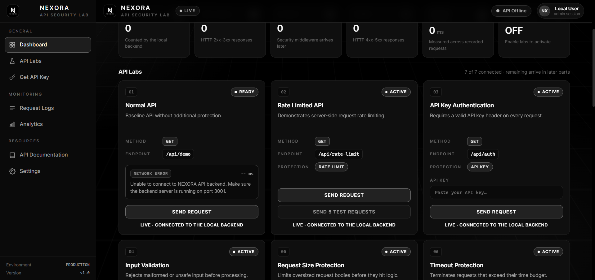

# NEXORA API Security Lab

A production-ready educational platform demonstrating seven core API protection mechanisms through interactive labs. Built as a distributed system with a React frontend and Vercel serverless backend, featuring real-time metrics, request logging, and a secure API key management system.

**Status: All 7 lab modules + API key issuer fully implemented and deployed.**

---

## Dashboard



---

## Project Highlights

- **Full-stack TypeScript** across frontend (React 18, Vite) and backend (Vercel serverless functions)
- **Seven security labs** covering rate limiting, authentication, validation, payload limits, timeouts, and layered defense
- **Real-time observability** with in-memory metrics, request logging, and live dashboard updates via health polling
- **Secure API key management** with timing-safe verification, HMAC-signed sessions, and admin key issuance/revocation
- **KV-backed state** using Vercel KV / Upstash Redis for distributed rate limiting, metrics persistence, and key storage
- **Production deployment** on Vercel with CI/CD, environment-based configuration, and CORS origin locking
- **Comprehensive test suite** (65 tests) covering edge cases, leak prevention, metric accuracy, and isolation

---

## Tech Stack

| Layer | Technologies |
|-------|--------------|
| Frontend | React 18, TypeScript (strict), Vite 5, React Router 6, hand-written CSS (design system) |
| Backend | Vercel Serverless Functions (Node.js), TypeScript, Vercel KV / Upstash Redis |
| Testing | Node built-in test runner (`node:test`) with tsx |
| Deployment | Vercel (auto-deploy from GitHub), GitHub Actions ready |

---

## Architecture

```
nexora-api-security-lab/          # Frontend repository (Vercel)
  frontend/
    src/
      components/     # Header, Sidebar, LabCard, DataTable, Toast, StatusPanel
      pages/          # Dashboard, ApiLabs, RequestLogs, Analytics, ApiDocs, Settings
      layouts/        # MainLayout (application shell)
      hooks/          # useServicesHealth (live /health polling), useLabRunner
      styles/         # global.css (dark developer-tool design system)
      utils/          # apiClient (typed fetch wrapper), constants, format helpers

NEXORA/                       # Backend repository (Vercel)
  api/
    health.js       # GET /health - service status, config, limiter state
    demo.js         # GET /api/demo - baseline unprotected endpoint
    rate-limit.js   # GET /api/rate-limit - fixed-window rate limiting (10 req/60s)
    auth.js         # GET /api/auth - API key verification (X-API-Key header)
    validate.js     # POST /api/validate - strict schema validation (name/email/age)
    payload.js      # POST /api/payload - request size enforcement (413)
    timeout.js      # GET /api/timeout - deadline enforcement (504)
    protected.js    # GET /api/protected - multi-layer: rate limit + API key (DoS-first)
    metrics.js      # GET /api/metrics - aggregated counters (total/success/error/blocked/latency)
    logs.js         # GET /api/logs - recent request history (redacted)
    keys.js         # GET/POST/DELETE /api/keys - API key lifecycle (admin)
    _lib.js         # Shared: rate limiting, metrics, logs, key hashing, KV ops
```

**Data flow:** Frontend (nexoralab-phi.vercel.app) → Backend APIs (nexora-navy-omega.vercel.app/api/*)

---

## API Endpoints

| Method | Path | Protection | Description |
|--------|------|------------|-------------|
| GET | `/health` | None | Service status, environment, limiter config, auth state, KV availability |
| GET | `/api/demo` | None | Baseline endpoint for comparison |
| GET | `/api/rate-limit` | Rate Limit | Fixed-window (10 req/60s), standard headers, 429 with Retry-After |
| GET | `/api/auth` | API Key | Timing-safe verification, generic 401, key redaction in logs |
| POST | `/api/validate` | Input Validation | Strict schema, all errors at once, unknown field rejection, sanitized echo |
| POST | `/api/payload` | Size Limit | Early Content-Length check + parser ceiling, 413 with byte counts |
| GET | `/api/timeout` | Timeout | Deadline wrapper, structured 504, client never hangs |
| GET | `/api/protected` | Multi-Layer | Dedicated strict limiter (5/60s) before API key auth (DoS-first) |
| GET | `/api/metrics` | None | Aggregated counters, per-path breakdown, avg latency |
| GET | `/api/logs` | None | Recent requests (IP, path, status, latency, blocked flag) |
| GET | `/api/keys` | Admin (session) | List issued keys (metadata only, no secrets) |
| POST | `/api/keys` | Admin (session) | Create new API key with TTL, returns full key once |
| DELETE | `/api/keys` | Admin (session) | Revoke key by ID |

---

## Security Implementation Details

**Rate Limiting** — Fixed-window algorithm per client IP. Headers: `X-RateLimit-Limit`, `X-RateLimit-Remaining`, `X-RateLimit-Reset`. Blocked requests counted separately from errors. Isolated limiter instances per lab.

**API Key Authentication** — HMAC-SHA256 timing-safe comparison. Keys hashed at rest (SHA-256 + salt). Demo key and issued keys both accepted. Generic 401 prevents enumeration. Keys never logged or returned after creation.

**Input Validation** — Deny-by-default schema. All violations collected before response. Unknown fields rejected explicitly. Malformed JSON handled at route level with structured error. Accepted payloads sanitized (trimmed, normalized).

**Request Size Protection** — Two-layer defense: early `Content-Length` rejection before body read, plus scoped JSON parser ceiling. Only byte counts recorded.

**Timeout Protection** — Deadline-based cancellation. Simulated upstream work exceeds configured timeout. Structured 504 response with timeout metadata. Client connection never blocked indefinitely.

**Multi-Layer Defense** — Rate limiter executes before authentication (DoS-first ordering). Flood of invalid keys receives 429, not 401. Shield window fully isolated from primary rate-limit lab.

**Observability** — Metrics exclude health/logs/metrics traffic. Request logs redact API keys (`[REDACTED]`). Blocked requests tracked separately from errors.

---

## Configuration

### Frontend (nexora-api-security-lab)

| Variable | Description | Example |
|----------|-------------|---------|
| `VITE_API_BASE_URL` | Backend API origin | `https://nexora-navy-omega.vercel.app` |

### Backend (NEXORA)

| Variable | Default | Description |
|----------|---------|-------------|
| `LAB_DEMO_API_KEY` | Required | Demo key for auth lab (public dev value) |
| `RATE_LIMIT_MAX` | 10 | Primary rate-limit window max requests |
| `RATE_LIMIT_WINDOW_SECONDS` | 60 | Primary rate-limit window size |
| `PROTECTED_RATE_LIMIT_MAX` | 5 | Multi-layer lab rate-limit max |
| `PROTECTED_RATE_LIMIT_WINDOW_SECONDS` | 60 | Multi-layer lab window size |
| `PAYLOAD_MAX_KB` | 64 | Max request body size (KB) |
| `TIMEOUT_MS` | 2000 | Timeout lab deadline (ms) |
| `KEY_ISSUE_MAX` | 10 | Key issuance rate limit (per window) |
| `KEY_ISSUE_WINDOW_SECONDS` | 300 | Key issuance window (5 min) |

**Storage:** Vercel KV (enable in project settings) or Upstash Redis REST credentials (`KV_REST_API_URL`, `KV_REST_API_TOKEN`).

---

## Local Development

### Frontend

```bash
cd nexora-api-security-lab/frontend
npm install
npm run dev          # http://localhost:5173
```

Create `frontend/.env`:
```
VITE_API_BASE_URL=http://localhost:3000
```

### Backend (Vercel CLI)

```bash
cd NEXORA
npm install -g vercel
vercel dev           # http://localhost:3000
```

---

## Deployment

**Frontend** — Push to `kunalsharma0354/Api-Security-Lab` → Vercel auto-deploys. Set `VITE_API_BASE_URL` in Vercel project settings.

**Backend** — Push to `kunalsharma0354/NEXORA` → Vercel auto-deploys. Enable KV storage. Set environment variables in Vercel project settings.

---

## Lab Modules

| # | Module | Endpoint | Protection | Status |
|---|--------|----------|------------|--------|
| 1 | Normal API | `GET /api/demo` | None | Live |
| 2 | Rate Limited API | `GET /api/rate-limit` | Fixed-window rate limit | Live |
| 3 | API Key Authentication | `GET /api/auth` | API key (timing-safe) | Live |
| 4 | Input Validation | `POST /api/validate` | Strict schema validation | Live |
| 5 | Request Size Protection | `POST /api/payload` | Size limit (413) | Live |
| 6 | Timeout Protection | `GET /api/timeout` | Deadline enforcement (504) | Live |
| 7 | Multi-Layer Protected API | `GET /api/protected` | Rate limit + API key (DoS-first) | Live |

---

## Development Roadmap

| Phase | Scope | Status |
|-------|-------|--------|
| 1 | Foundation, design system, dashboard UI | Complete |
| 2 | Backend endpoints, health/metrics/logs, request logging, live stats | Complete |
| 3 | Rate limiting middleware, headers, 429 handling, burst UI, test suite (15) | Complete |
| 4 | API key auth, timing-safe compare, fail-fast config, key redaction, test suite (26) | Complete |
| 5 | Input validation, all-errors-at-once, unknown field rejection, sanitized echo, test suite (46) | Complete |
| 6 | Payload size protection, early rejection, parser ceiling, test coverage | Complete |
| 7 | Timeout protection, deadline wrapper, structured 504, blocked classification | Complete |
| 8 | Multi-layer protection, DoS-first ordering, isolated shield, flood UI, test suite (65) | Complete |
| Future | Persistence (SQLite), analytics charts, historical trends | Planned |

See `docs/roadmap.md` for detailed phase breakdown.

---

## Repository & Live Demo

- **Frontend Repository:** https://github.com/kunalsharma0354/Api-Security-Lab
- **Backend Repository:** https://github.com/kunalsharma0354/NEXORA
- **Live Demo:** https://nexoralab-phi.vercel.app
- **Backend API:** https://nexora-navy-omega.vercel.app